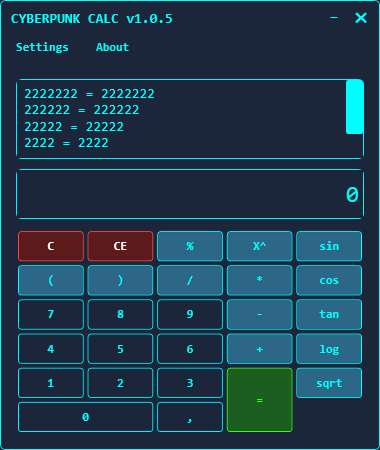
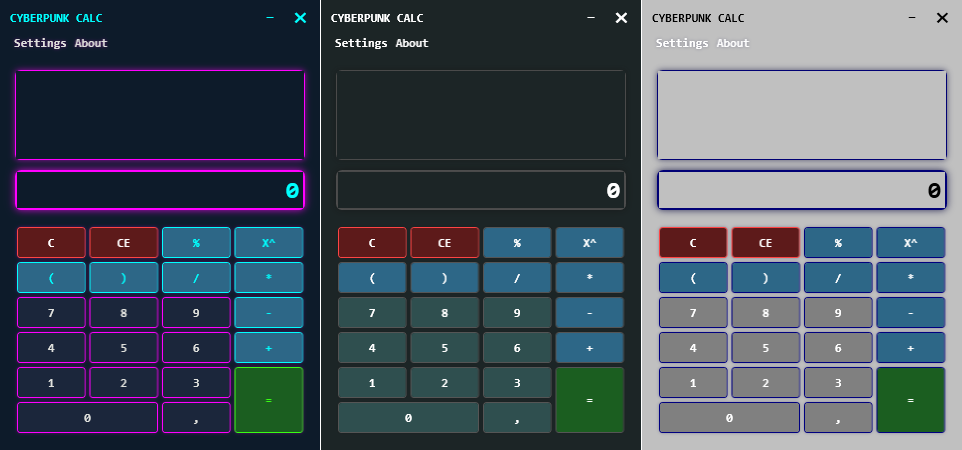

# CyberCalc.NET9

This project is a modernized port of the classic WPF-CALC, rewritten from .NET Framework to .NET 9, introducing new Cyberpunk and Legacy themes while preserving the core calculator functionality.

## Features
- Basic & advanced calculations
- Cyberpunk/Light/Dark theme
- Error handling
- Recent operations history
- **Keyboard shortcuts support**
- Modernized WPF interface with Cyberpunk aesthetics

## Screenshots

Version 1.0.5 – Core & Interface Evolution
- Implemented new calculation core for better performance and stability
- Added new mathematical functions: sin, cos, tan, log, sqrt
- Refined Cyberpunk-themed interface
- Minor bug fixes and optimizations


### Version 1.0.6 – Interface Evolution


### Version 1.0.4



## Quick Start

Build and run from source:

```bash
git clone https://github.com/ZeroDayZ7/CyberCalc.NET9.git
cd CyberCalc.NET9
dotnet build
dotnet run
````

## Downloads / Installer

You can also download the pre-built installer from the [Releases](https://github.com/ZeroDayZ7/CyberCalc.NET9/releases) page to quickly install and run the application without building it from source.

## Prerequisites

* [.NET 9 SDK](https://dotnet.microsoft.com/en-us/download/dotnet/9.0)
* (Optional) Visual Studio 2022/2023 with WPF workload

## License

This project is provided as a trial version. All rights reserved.
